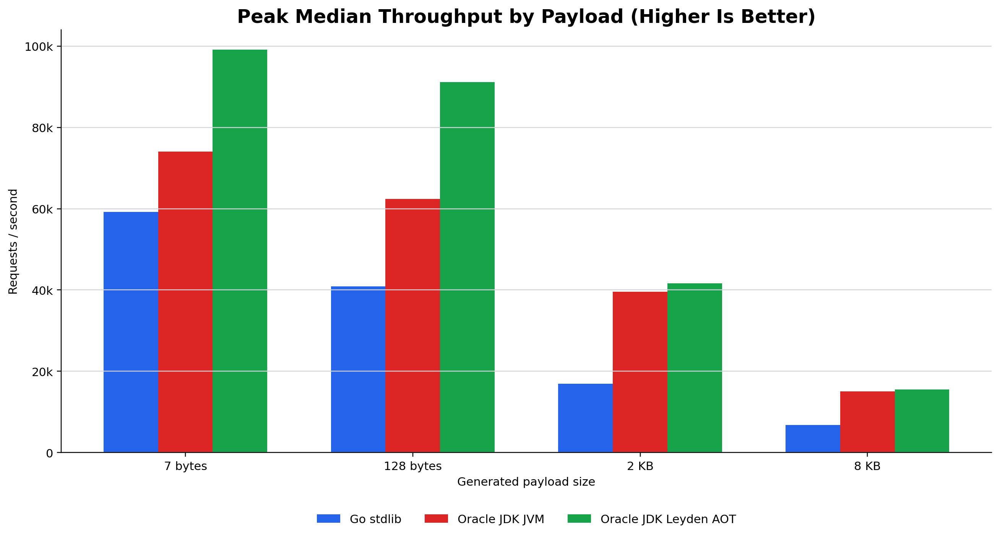
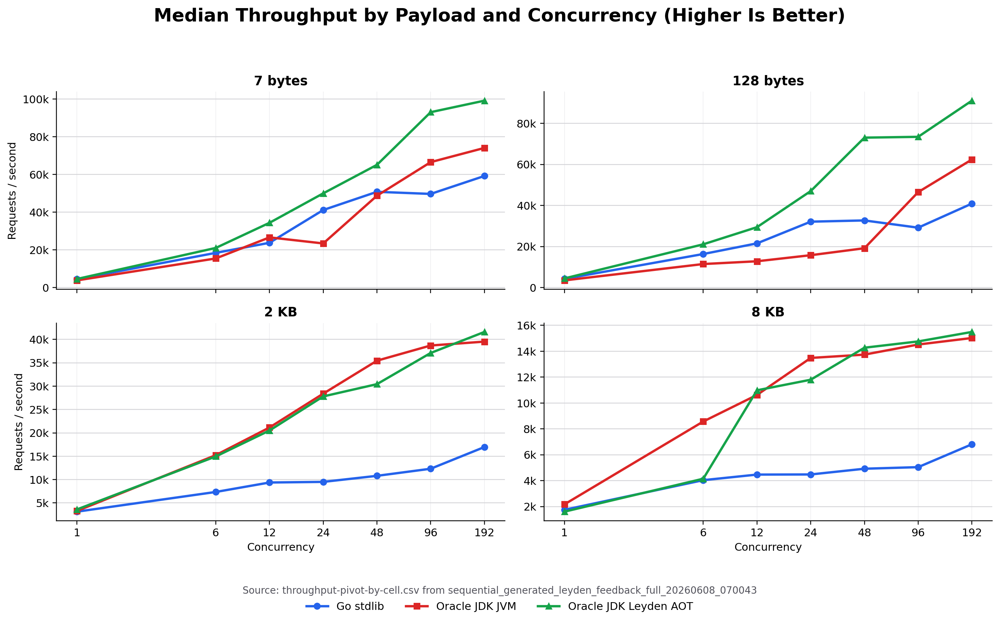
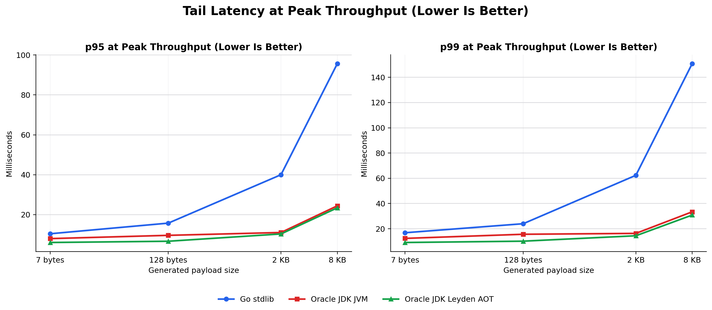

# Can Java Microservices Be As Fast As Go? A 2026 Benchmark Update

In November 2020, Peter Nagy and I asked a question that was simple enough to be fun and annoying enough to be useful:

Can Java microservices be as fast as Go microservices?

It was not meant to be a language war. Those are usually boring, and worse, they tend to make people less curious. The original question was more practical than that. If you take a small HTTP service, implement it carefully in Go and Java, and then run it on the same hardware, do the results land in the same performance neighborhood?

The answer, back then, was more interesting than a clean win or loss. Go did very well on smaller runs. Java became more competitive as the hardware and workload got larger. Logging mattered. Warmup mattered. The shape of the machine mattered. Kubernetes changed the picture again.

That was the useful part. Not a trophy. A reminder.

So I wanted to ask it again.

Not "is Java faster than Go?"

Not "did Go lose?"

Not "did the JVM solve all computer problems and also fold the laundry?"

The better question is this:

For this service, on this machine, with current runtimes, what actually happens as we increase payload size and concurrency?

The code and results for this update are in this repository:

```text
/home/mark/redstack/go-java-go-2026
```

## The Baseline

For this local run I used:

- Go 1.26.3
- Oracle JDK 26.0.1
- Helidon SE 4.4.1
- Linux on x86_64
- Intel Xeon W-11855M, 6 cores / 12 threads
- About 62 GiB RAM

The Go service uses the standard library `net/http` server. No framework. No middleware stack.

The Java service uses Helidon SE WebServer. Helidon 4 uses virtual threads for request handling, and the service health endpoint confirms that request work is running on virtual threads.

For the Java side I measured two runtime shapes:

- Oracle JDK JVM
- Oracle JDK with a Leyden AOT cache

That is enough for this pass. It keeps the article focused on the question I actually measured: a compact Go service against a compact Java service, both running sequentially on the same local machine.

## The Service

Both services expose the same basic endpoints:

```text
GET /health
GET /ready
GET /api/strings/{value}
GET /api/generated/{size}
```

The `strings` endpoint is useful for simple functional checks. The generated endpoint is the one I used for the benchmark matrix.

That distinction matters.

In an early run I tested a 2 KB input by putting a 2 KB string directly in the URL path. That mostly told me how each router handled a silly path parameter. Interesting, maybe, but not the thing I wanted to measure. The final full run uses `/api/generated/{size}` so the URL stays small and the application generates the requested input size inside the handler.

Each request does the same small unit of work:

- uppercase the input
- lowercase the input
- reverse the input
- compute a CRC32 hash
- repeat extra CRC work according to `WORK_FACTOR`
- return JSON with the result and runtime metadata

For the final full run, `WORK_FACTOR=10`. Request logging was off.

This is still a small synthetic service. It is not a shopping cart, a fraud system, or a payments API. It has no database, no TLS, no queue, no JSON parser on the inbound side, and no remote dependency. That is intentional. The point is to make the hot path small enough that runtime and server behavior are visible.

## The Benchmark Shape

The benchmark runner starts one service, runs the full matrix, stops it, and then starts the next service. Go and Java do not run at the same time, so they are not competing with each other for CPU or memory.

The final full run used:

```text
payload sizes:      7, 128, 2048, 8192 bytes
concurrency levels: 1, 6, 12, 24, 48, 96, 192
repeats per cell:   2
warmup per cell:    10 seconds
service warmup:     10 seconds after each service starts
measurement window: 5 seconds
work factor:        10
```

The runtime settings were explicit:

```text
Go:
  GOMAXPROCS=12
  GOMEMLIMIT=off

Java:
  -XX:ActiveProcessorCount=12
  -XX:MaxRAMPercentage=75

Leyden replay:
  -XX:+UnlockDiagnosticVMOptions
  -XX:-AOTRecordTraining
  -XX:-AOTReplayTraining
```

The results are saved here:

```text
results/sequential_generated_leyden_feedback_full_20260608_070043/
```

The useful files are:

```text
configurations.csv
measurements.csv
summary-by-cell.csv
peak-throughput-by-payload.csv
throughput-pivot-by-cell.csv
```

The pivot file is meant for charts. It pivots median throughput by payload and concurrency, with one column per runtime variant.

## The Boring Tuning Detail That Changed The Java Result

Before the benchmark run, I hit a strange result.

The Helidon service looked fine for tiny responses, but larger generated responses had a suspicious latency floor around 44 to 48 ms when the Go load driver reused persistent HTTP/1.1 connections. A fresh `curl` request did not show the same behavior after warmup. That smelled less like application code and more like packet behavior.

The fix was:

```java
WebServer server = WebServer.builder()
        .port(port)
        .connectionOptions(socket -> socket.tcpNoDelay(true))
        .routing(routing -> routing
                .get("/health", (req, res) -> health(res))
                .get("/ready", (req, res) -> ready(res))
                .get("/api/strings/{value}", (req, res) -> strings(req, res, logRequests, workFactor))
                .get("/api/generated/{size}", (req, res) -> generated(req, res, logRequests, workFactor)))
        .build()
        .start();
```

After setting `tcpNoDelay(true)`, the 2 KB persistent-connection case moved from "obviously broken benchmark" to "serious server." That is exactly why these tests are worth running before writing the article. A single missed production setting can turn into a confident but wrong conclusion.

Both services also set `Content-Length` explicitly for known-size JSON responses.

## What Happened

Here is the short version: for this service, on this machine, Java was not merely "as fast as Go." Once the test moved beyond the smallest case, the Java implementation often scaled better.

For this update, the runner used a 10-second service warmup after each service started, plus a 10-second warmup before every measured cell. The first draft of the run used only a 2-second per-cell warmup. After feedback from the Leyden team, the final full run also ran the Leyden replay with diagnostic options that disable record and replay training during measurement.

At the smallest generated payload, all three runs were in the same neighborhood at low concurrency. With one worker and a 7-byte payload, Go reached about 4,501 requests per second. The regular Oracle JDK run reached about 3,828 requests per second, and the Leyden AOT run reached about 4,570.

That is a close small-service result. It is also the sort of result people tend to remember from older Java versus Go conversations: Go starts fast, the code is compact, and the low-concurrency case looks good.

But the shape changed as concurrency rose.

At 192 concurrent workers and the same 7-byte generated payload, Go reached about 59,173 requests per second. The regular Oracle JDK run reached about 74,044 requests per second. The Leyden AOT run reached about 99,099 requests per second.

At 128 bytes, the Java variants pulled ahead at higher concurrency. At 192 concurrent workers, Go reached about 40,928 requests per second. The regular Oracle JDK run reached about 62,433. The Leyden AOT run reached about 91,124.

At 2 KB, the gap was larger. Go peaked at about 16,971 requests per second. The regular Oracle JDK run peaked at about 39,532 requests per second, and the Leyden AOT run peaked at about 41,604.

At 8 KB, both Java shapes were well ahead of Go in this local run. Go peaked at about 6,815 requests per second. The regular Oracle JDK run peaked at about 15,025, and the Leyden AOT run peaked at about 15,493.

The peak-throughput table from this run looks like this:

| Payload | Go peak rps | Oracle JDK JVM peak rps | Oracle JDK Leyden AOT peak rps |
| --- | ---: | ---: | ---: |
| 7 bytes | 59,173 | 74,044 | 99,099 |
| 128 bytes | 40,928 | 62,433 | 91,124 |
| 2 KB | 16,971 | 39,532 | 41,604 |
| 8 KB | 6,815 | 15,025 | 15,493 |

And the high-concurrency cells that anchor the narrative are:

| Payload at concurrency 192 | Go rps | Oracle JDK JVM rps | Oracle JDK Leyden AOT rps |
| --- | ---: | ---: | ---: |
| 7 bytes | 59,173 | 74,044 | 99,099 |
| 128 bytes | 40,928 | 62,433 | 91,124 |
| 2 KB | 16,971 | 39,532 | 41,604 |
| 8 KB | 6,815 | 15,025 | 15,493 |







No measured row in the final full run had request failures.

That is the interesting version of the story. Not a slogan, but a curve.

For the smallest case, the services are in the same range at low concurrency, but Leyden AOT pulls away at the high-concurrency end. As the generated payload grows, Java's advantage shows up earlier and more strongly.

That does not mean "Java is faster than Go." It means this Java implementation, on this JDK, with Helidon virtual-thread request handling and the right socket setting, scaled better than this Go implementation in this local matrix.

That sentence has a lot of nouns in it. It needs all of them.

## What Leyden AOT Did

Leyden AOT did not simply make every individual cell faster, but with the replay training options disabled during measurement it changed the headline result substantially.

It had the best peak throughput for every payload in this run. At 7 bytes, the Leyden peak was about 99,099 requests per second at concurrency 192, with p95 around 6.0 ms and p99 around 9.1 ms. At 128 bytes it peaked around 91,124 requests per second. At 2 KB it peaked around 41,604. At 8 KB it peaked around 15,493.

That does not mean Leyden won every row. Leyden AOT had the highest throughput in 20 of the 28 payload/concurrency cells, while the regular Oracle JDK JVM run won the other 8. Go did not win an individual cell in this final matrix, though it stayed close at the smallest low-concurrency cases. The overall peak-throughput story shifted: Leyden AOT was the highest peak runtime shape for each payload in this matrix.

That is not disappointing. It is useful. Leyden AOT is not a magic "make benchmark bigger" switch. It changes startup, warmup, and runtime behavior in ways that need to be measured against the workload you actually care about.

For this article, the honest summary is:

Leyden AOT was strongest in the peak-throughput view after the measurement run separated warmup more carefully and disabled Leyden record/replay training during replay. Startup and footprint still deserve their own pass.

## What The Results Mean

The old easy argument was that Go is the obvious choice for small network services because Java is too heavy.

That argument does not survive this run.

Go remains excellent for small services. The implementation is compact. The toolchain is simple. The standard HTTP server is capable. The single-binary deployment story is still very attractive.

Modern Java is also excellent for small services, and it has a very different set of strengths. The JVM has a mature optimizer, rich observability tools, excellent GC engineering, and now a mainstream virtual-thread model that makes blocking server code feel much less expensive than it used to.

Helidon SE keeps the Java side small enough that this comparison is not "minimal Go versus enormous Java framework." It is a compact Java service using a compact Java server.

This does not mean I would take these numbers and make a company-wide language policy. Please do not do that. That is how benchmark articles become office folklore, and office folklore is where nuance goes to quietly retire.

What I would take from this run is more practical:

Language matters, but runtime, framework, hardware shape, warmup, logging, socket options, packaging, and measurement design often matter more than our slogans.

## What I Would Measure Next

Throughput is only one part of the story.

The next pass should add:

- startup time
- RSS and heap usage
- CPU utilization
- GC logs
- Java Flight Recorder
- async-profiler
- longer runs
- more repeats per cell
- isolated load generator host
- container limits
- TLS
- request logging on and off
- Spring Boot
- at least one real dependency, such as a database call

I would also keep the `tcpNoDelay` lesson in the benchmark checklist. It is not glamorous, but neither is being wrong by 40 milliseconds.

## How To Reproduce This Run

Build the Java service:

```bash
cd helidon-service
JAVA_HOME=/home/mark/jdk-26.0.1 \
PATH=/home/mark/jdk-26.0.1/bin:/home/mark/apache-maven-3.9.12/bin:$PATH \
mvn -B -DskipTests package
```

Run the sequential matrix:

```bash
RESULTS_DIR=/home/mark/redstack/go-java-go-2026/results/sequential_generated_$(date +%Y%m%d_%H%M%S) \
GO_PORT=26381 \
JAVA_PORT=26382 \
CONCURRENCY_LEVELS="1 6 12 24 48 96 192" \
PAYLOAD_SIZES="7 128 2048 8192" \
REPEATS=2 \
DURATION=5s \
WARMUP_DURATION=10s \
SERVICE_WARMUP_DURATION=10s \
JAVA_VARIANTS="oracle-jdk-jvm oracle-jdk-leyden-aot" \
WORK_FACTOR=10 \
ENDPOINT_MODE=generated \
scripts/run-sequential-matrix.sh
```

The runner writes the raw and summarized tables automatically.

## The Bit I Still Believe

The original article did not settle the question forever. It was never going to.

Performance is not just a property of a language.

It is also a property of:

- hardware shape
- runtime version
- framework choices
- warmup
- logging
- serialization
- socket options
- container limits
- GC behavior
- load-driver design
- measurement duration
- noisy neighbors
- the parts of the service that are not in your benchmark

That was true in 2020, and it is still true in 2026.

So, can Java microservices be as fast as Go?

For this service, on this machine, with these versions, yes. And as the payload and concurrency grew, the Java implementation was often faster.

That is not a trophy. It is a measurement.

The useful next question is not "which language won?"

It is "which runtime shape do you want to operate, observe, tune, deploy, and live with in production?"

That is a better question. It gives you something to measure, something to improve, and, on a good day, something worth changing your mind about.
